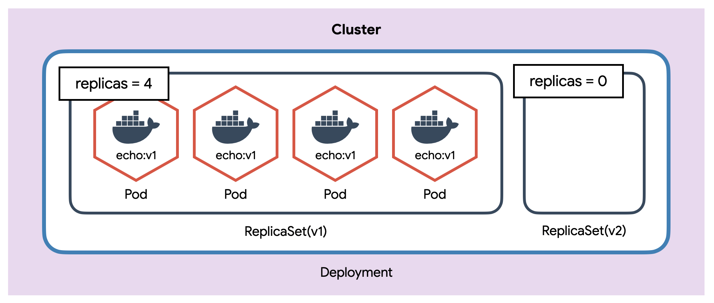
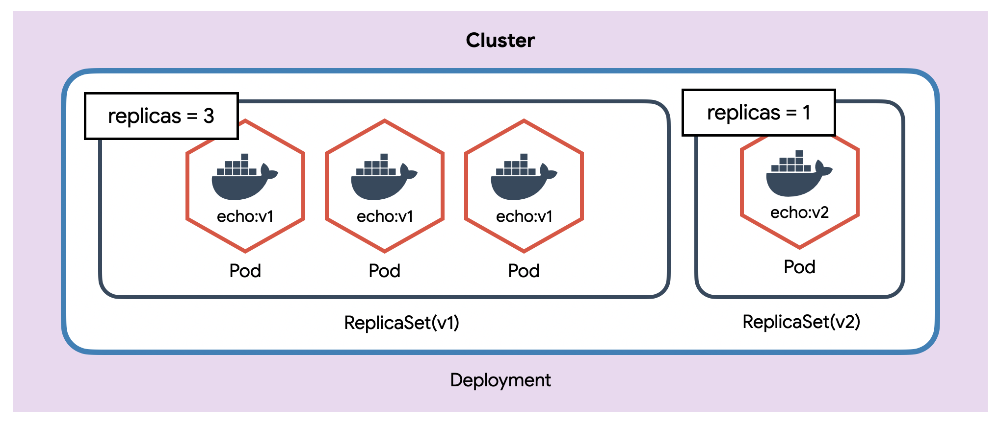
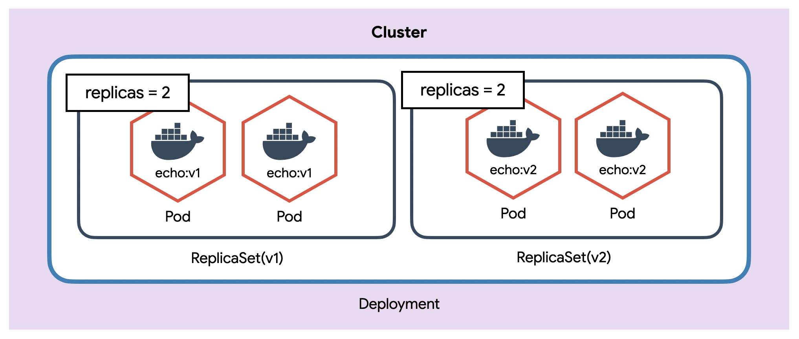

# Deployment

::: tip 배울점
Deployment(배포)를 이용하여 Pod을 새로운 버전으로 업데이트하고 롤백하는 방법을 알아봅니다.
:::

Deployment는 쿠버네티스에서 가장 널리 사용되는 오브젝트입니다. ReplicaSet을 이용하여 Pod을 업데이트하고 이력을 관리하여 롤백<sup>Rollback</sup>하거나 특정 버전<sup>revision</sup>으로 돌아갈 수 있습니다.

[[toc]]

## Deployment 만들기

이전에 만든 ReplicaSet을 Deployment로 만들어 봅니다.

<<< @/src/.vuepress/public/code/guide/deployment/echo-deployment.yml{2,4}
<code-link link="guide/deployment/echo-deployment.yml"/>

설정을 어디서 많이 본 것 같지 않으세요? type을 제외하곤 ReplicaSet과 **완전히 동일**합니다.

일단 만들고 차이점을 확인해봅니다.

```sh
# Deployment 생성
kubectl apply -f echo-deployment.yml

# 리소스 확인
kubectl get po,rs,deploy
```

**실행 결과**

```
NAME                               READY   STATUS    RESTARTS   AGE
pod/echo-deploy-76dcd9f4f9-clx78   1/1     Running   0          17s
pod/echo-deploy-76dcd9f4f9-jxnzx   1/1     Running   0          17s
pod/echo-deploy-76dcd9f4f9-kfl25   1/1     Running   0          17s
pod/echo-deploy-76dcd9f4f9-p8b85   1/1     Running   0          17s

NAME                                     DESIRED   CURRENT   READY   AGE
replicaset.apps/echo-deploy-76dcd9f4f9   4         4         4       17s

NAME                          READY   UP-TO-DATE   AVAILABLE   AGE
deployment.apps/echo-deploy   4/4     4            4           17s
```

결과 또한 ReplicaSet과 비슷해 보이지만 Deployment의 진가는 Pod을 새로운 이미지로 업데이트할 때 발휘됩니다.

기존 설정에서 이미지 태그만 변경하고 다시 적용합니다.

<<< @/src/.vuepress/public/code/guide/deployment/echo-deployment-v2.yml{19}
<code-link link="guide/deployment/echo-deployment-v2.yml"/>

```sh
# 새로운 이미지 업데이트
kubectl apply -f echo-deployment-v2.yml

# 리소스 확인
kubectl get po,rs,deploy
```

**실행 결과**

```{8,9}
NAME                               READY   STATUS    RESTARTS   AGE
pod/echo-deploy-77cd7699f4-jg7ws   1/1     Running   0          33s
pod/echo-deploy-77cd7699f4-rpbjx   1/1     Running   0          20s
pod/echo-deploy-77cd7699f4-rtgcv   1/1     Running   0          19s
pod/echo-deploy-77cd7699f4-rw29n   1/1     Running   0          33s

NAME                                     DESIRED   CURRENT   READY   AGE
replicaset.apps/echo-deploy-76dcd9f4f9   0         0         0       3m35s
replicaset.apps/echo-deploy-77cd7699f4   4         4         4       33s

NAME                          READY   UP-TO-DATE   AVAILABLE   AGE
deployment.apps/echo-deploy   4/4     4            4           3m35s
```

Pod이 모두 새로운 버전으로 업데이트되었습니다.

::: warning Pod 업데이트
엄밀히 말하면 "Pod을 새로운 버전으로 업데이트한다"는 건 잘못된 표현이고, "새로운 버전의 Pod을 생성하고 기존 Pod을 제거한다"가 정확한 표현입니다.
:::

Deployment는 새로운 이미지로 업데이트하기 위해 ReplicaSet을 이용합니다. 버전을 업데이트하면 새로운 ReplicaSet을 생성하고 해당 ReplicaSet이 새로운 버전의 Pod을 생성합니다.



새로운 ReplicaSet을 0 -> 1개로 조정하고 정상적으로 Pod이 동작하면 기존 ReplicaSet을 4 -> 3개로 조정합니다.



새로운 ReplicaSet을 1 -> 2개로 조정하고 정상적으로 Pod이 동작하면 기존 ReplicaSet을 3 -> 2개로 조정합니다.



새로운 ReplicaSet을 2 -> 3개로 조정하고 정상적으로 Pod이 동작하면 기존 ReplicaSet을 2 -> 1개로 조정합니다.


최종적으로 새로운 ReplicaSet을 4개로 조정하고 정상적으로 Pod이 동작하면 기존 ReplicaSet을 0개로 조정합니다. 🎉 업데이트 완료!


생성한 Deployment의 상세 상태를 보면 더 자세히 알 수 있습니다.

```sh
kubectl describe deploy/echo-deploy
```

**실행 결과**

```{6,8,10,12,14}
...(생략)...

Events:
  Type    Reason             Age   From                   Message
  ----    ------             ----  ----                   -------
  Normal  ScalingReplicaSet  5m    deployment-controller  Scaled up replica set echo-deploy-76dcd9f4f9 to 4
  Normal  ScalingReplicaSet  2m    deployment-controller  Scaled up replica set echo-deploy-77cd7699f4 to 1
  Normal  ScalingReplicaSet  2m    deployment-controller  Scaled down replica set echo-deploy-76dcd9f4f9 to 3
  Normal  ScalingReplicaSet  2m    deployment-controller  Scaled up replica set echo-deploy-77cd7699f4 to 2
  Normal  ScalingReplicaSet  2m    deployment-controller  Scaled down replica set echo-deploy-76dcd9f4f9 to 2
  Normal  ScalingReplicaSet  2m    deployment-controller  Scaled up replica set echo-deploy-77cd7699f4 to 3
  Normal  ScalingReplicaSet  2m    deployment-controller  Scaled down replica set echo-deploy-76dcd9f4f9 to 1
  Normal  ScalingReplicaSet  2m    deployment-controller  Scaled up replica set echo-deploy-77cd7699f4 to 4
  Normal  ScalingReplicaSet  2m    deployment-controller  Scaled down replica set echo-deploy-76dcd9f4f9 to 0
```

아주 단순하면서 우아한 동작방식입니다. 각 컨트롤러는 다음과 같이 동작합니다.

```mermaid
sequenceDiagram
  autonumber
  participant A as API Server
  participant D as Deployment<br />Controller
  participant R as ReplicaSet<br />Controller
  participant S as Scheduler
  Note left of A: deployment.yml

  rect rgb(236, 240, 241)
    loop
      D->>A: 원하는 배포 상태 체크
      D->>A: 조건에 맞는 ReplicaSet 생성
    end
  end

  loop
    R->>A: ReplicaSet 조건 체크
    R->>A: 조건을 만족하기 위해 Pod 생성,제거
  end

  loop
    S->>A: 할당되지 않은 Pod 감시
    S->>A: Pod을 노드에 할당
  end

  Note right of S: Kubelet,<br>Container,<br>..(생략)..
```

1. `Deployment Controller`는 Deployment조건을 감시하면서 현재 상태와 원하는 상태가 다른 것을 체크
2. `Deployment Controller`가 원하는 상태가 되도록 `ReplicaSet` 설정
3. `ReplicaSet Controller`는 ReplicaSet조건을 감시하면서 현재 상태와 원하는 상태가 다른 것을 체크
4. `ReplicaSet Controller`가 원하는 상태가 되도록 `Pod`을 생성하거나 제거
5. `Scheduler`는 API서버를 감시하면서 할당되지 않은<sup>unassigned</sup> `Pod`이 있는지 체크
6. `Scheduler`는 할당되지 않은 새로운 `Pod`을 감지하고 적절한 `노드`<sup>node</sup>에 배치
7. 이후 노드는 기존대로 동작

Deployment는 Deployment Controller가 관리하고 ReplicaSet과 Pod은 기존 Controller와 Scheduler가 관리합니다.

## 버전관리

Deployment는 변경된 상태를 기록합니다.

```sh
# 히스토리 확인
kubectl rollout history deploy/echo-deploy

# revision 1 히스토리 상세 확인
kubectl rollout history deploy/echo-deploy --revision=1

# 바로 전으로 롤백
kubectl rollout undo deploy/echo-deploy

# 특정 버전으로 롤백
kubectl rollout undo deploy/echo-deploy --to-revision=2
```

## 배포 전략 설정

Deployment 다양한 방식의 배포 전략이 있습니다. 여기선 롤링업데이트<sup>RollingUpdate</sup> 방식을 사용할 때 동시에 업데이트하는 Pod의 개수를 변경해보겠습니다.

<<< @/src/.vuepress/public/code/guide/deployment/echo-strategy.yml{12-16}
<code-link link="guide/deployment/echo-strategy.yml"/>

Deployment를 생성하고 결과를 확인해봅니다.

```sh
kubectl apply -f echo-strategy.yml
kubectl get po,rs,deploy

# 이미지 변경 (명령어로)
kubectl set image deploy/echo-deploy-st echo=ghcr.io/subicura/echo:v2

# 이벤트 확인
kubectl describe deploy/echo-deploy-st
```

**실행 결과**

```{7}
...(생략)...

Events:
  Type    Reason             Age   From                   Message
  ----    ------             ----  ----                   -------
  Normal  ScalingReplicaSet  59s   deployment-controller  Scaled up replica set echo-deploy-st-679749cb78 to 4
  Normal  ScalingReplicaSet  29s   deployment-controller  Scaled up replica set echo-deploy-st-6754948699 to 3
  Normal  ScalingReplicaSet  29s   deployment-controller  Scaled down replica set echo-deploy-st-679749cb78 to 1
  Normal  ScalingReplicaSet  29s   deployment-controller  Scaled up replica set echo-deploy-st-6754948699 to 4
  Normal  ScalingReplicaSet  19s   deployment-controller  Scaled down replica set echo-deploy-st-679749cb78 to 0
```

Pod을 하나씩 생성하지 않고 한번에 3개가 생성된 것을 확인할 수 있습니다.

::: tip 배포 전략
maxSurge와 maxUnavailable의 기본값은 25%입니다. 대부분의 상황에서 적당하지만 상황에 따라 적절하게 조정이 필요합니다.
:::

## 마무리

Deployment는 가장 흔하게 사용하는 배포방식입니다. 이외에 StatefulSet, DaemonSet, CronJob, Job등이 있지만 사용법은 크게 다르지 않습니다.

쿠버네티스에서 컨테이너 생성 방법은 여기까지 알아보고 Pod을 외부로 노출하는 방법을 알아보겠습니다.

## 참고

[Deployment v1 apps](https://kubernetes.io/docs/reference/generated/kubernetes-api/v1.20/#deployment-v1-apps)

## 문제

**문제1. 다음 조건을 만족하는 Deployment를 만드세요.**

| 키                  | 값           |
| ------------------- | ------------ |
| `Deployment 이름`   | nginx        |
| `Deployment Label`  | app: nginx   |
| `Deployment 복제수` | 3            |
| `Container 이름`    | nginx        |
| `Container 이미지`  | nginx:1.14.2 |

::: details 정답
<<< @/src/.vuepress/public/code/guide/deployment/exam1.yml
<code-link link="guide/deployment/exam1.yml"/>
:::

**문제2. 복제개수를 5로 조정합니다**

::: details 정답
<<< @/src/.vuepress/public/code/guide/deployment/exam2.yml{6}
<code-link link="guide/deployment/exam2.yml"/>
:::

**문제3. 이미지를 nginx:1.19.5로 변경합니다**

::: details 정답
<<< @/src/.vuepress/public/code/guide/deployment/exam3.yml{17}
<code-link link="guide/deployment/exam3.yml"/>
:::
