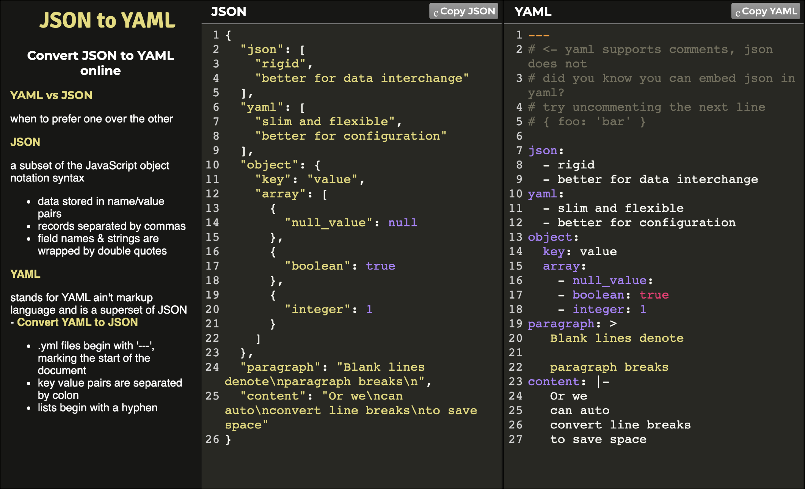
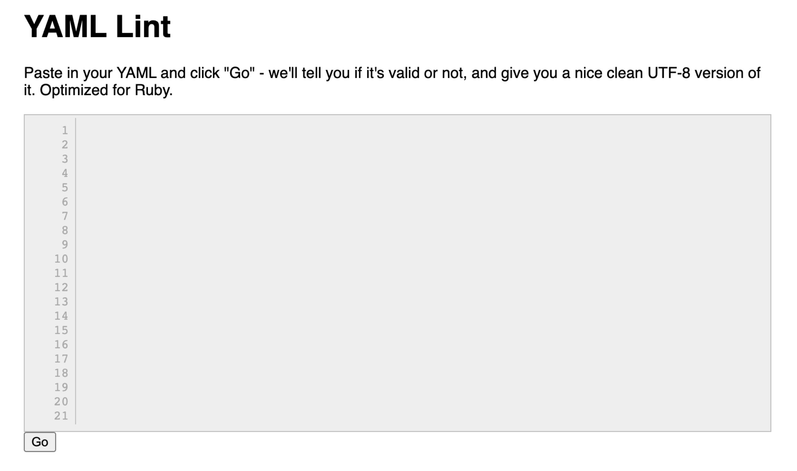

# YAML 문법

::: tip 배울점
YAML 문법에 대해 전반적으로 알아봅니다.
이미 익숙하더라도 한 번 더 체크해보세요!
:::


쿠버네티스 실습에서 중요한 건 아키텍처, 그다음이 **YAML**입니다. ~~앞으로 YAML파일을 수십 개 만들 겁니다~~ :dizzy_face:

<div style="text-align: center">
  
</div>

"블로그를 만들 건데, APP서버는 3개 띄워주시고 DB서버는 1대, 도메인은 blog.subicura.com으로 연결해주세요"를 쿠버네티스에 요청하려면 1. 어떤 오브젝트를 사용할지 정하고 2. 상세 설정을 **YAML형식**으로 정의해야 합니다.

[[toc]]

## 기본문법

### 들여쓰기 (indent)

들여쓰기는 기본적으로 **2칸** 또는 **4칸**을 지원합니다.

**2칸 들여쓰기 (추천)**

```yaml
person:
  name: Chungsub Kim
  job: Developer
  skills:
    - docker
    - kubernetes
```

**4칸 들여쓰기**

```
person:
    name: Chungsub Kim
    job: Developer
    skills:
        - docker
        - kubernetes
```

### 데이터 정의 (map)

데이터는 `key`: `value` 형식으로 정의합니다.

<code-group>
<code-block title="YAML">
```yaml
apiVersion: v1
kind: Pod
metadata:
  name: echo
  labels:
    type: app
```
</code-block>

<code-block title="JSON">
```json
{
  "apiVersion": "v1",
  "kind": "Pod",
  "metadata": {
    "name": "echo",
    "labels": {
      "type": "app"
    }
  }
}
```
</code-block>
</code-group>

### 배열 정의 (array)

배열은 `-`로 표시합니다.

<code-group>
<code-block title="YAML">
```yaml
person:
  name: Chungsub Kim
  job: Developer
  skills: 
    - docker
    - kubernetes
```
</code-block>

<code-block title="JSON">
```json
{
  "person": {
    "name": "Chungsub Kim",
    "job": "Developer",
    "skills": [
      "docker", "kubernetes"
    ]
  }
}
```
</code-block>
</code-group>

### 주석 (comment)

주석은 `#`으로 표시합니다.

**전체 라인 주석처리**

```yaml
# comment
person:
  name: Chungsub Kim
  job: Developer
  skills:
    - docker
    - kubernetes
```

**일부 주석처리**

```yaml
person:
  name: Chungsub Kim # subicura
  job: Developer
  skills:
    - docker
    - kubernetes
```

### 참/거짓, 숫자표현

참/거짓은 `true`, `false`외에 `yes`, `no`를 지원합니다.

**참/거짓**

```yaml
study_hard: yes
give_up: no
hello: True
world: TRUE
manual: false
```

**숫자**

정수 또는 실수를 따옴표(") 없이 사용하면 숫자로 인식합니다.

```yaml
# number
version: 1.2

# string
version: "1.2"
```

### 줄바꿈 (newline)

여러 줄을 표현하는 방법입니다.

**"|" 지시어는 마지막 줄바꿈이 포함**

<code-group>
<code-block title="YAML">
```yaml
newlines_sample: |
            number one line

            second line

            last line

````
</code-block>

<code-block title="JSON">
```json
{
  "newlines_sample": "number one line\n\nsecond line\n\nlast line\n"
}
````

</code-block>
</code-group>

**"|-" 지시어는 마지막 줄바꿈을 제외**

<code-group>
<code-block title="YAML">
```yaml
newlines_sample: |-
            number one line

            second line

            last line

````
</code-block>

<code-block title="JSON">
```json
{
  "newlines_sample": "number one line\n\nsecond line\n\nlast line"
}
````

</code-block>
</code-group>

**">" 지시어는 중간에 들어간 빈줄을 제외**

<code-group>
<code-block title="YAML">
```yaml
newlines_sample: >
            number one line

            second line

            last line

````
</code-block>

<code-block title="JSON">
```json
{
  "newlines_sample": "number one line\nsecond line\nlast line\n"
}
````

</code-block>
</code-group>

## 주의사항

### 띄어쓰기

key와 value사이에는 반드시 빈칸이 필요합니다.

```yaml
# error (not key-value, string)
key:value

# ok
key: value
```

### 문자열 따옴표

대부분의 문자열을 따옴표 없이 사용할 수 있지만 `:`가 들어간 경우는 반드시 따옴표가 필요합니다.

```yaml
# error
windows_drive: c:

# ok
windows_drive: "c:"
windows_drive: 'c:'
```

## 참고

### json2yaml

JSON에 익숙하신 분들을 위한 YAML 변환 사이트입니다.


[https://www.json2yaml.com/](https://www.json2yaml.com/)

### yamllint

YAML 문법을 체크하고 어떻게 해석하는지 결과를 알려줍니다.


[http://www.yamllint.com/](http://www.yamllint.com/)
